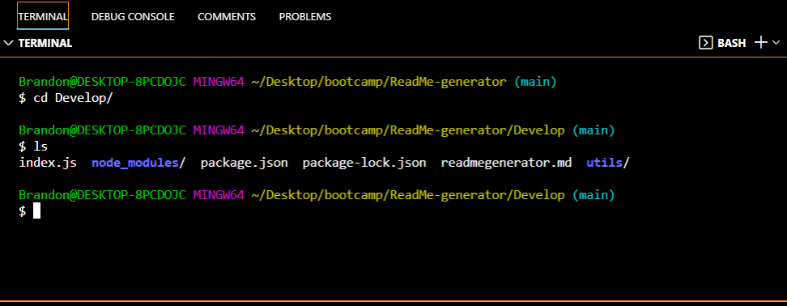
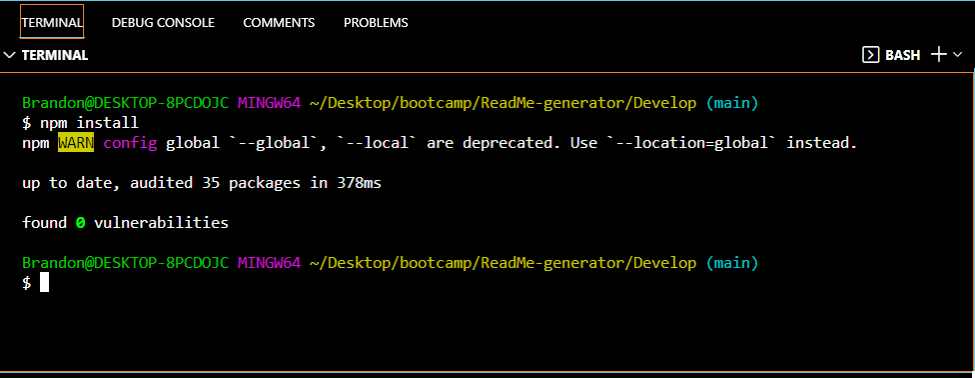
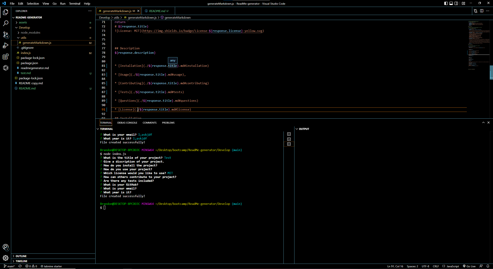

# README Generator

This project is an example of a program that asks the user a series of questions in the console, and based upon those answers, the program will dynamically generate a readme file that is named based upon the user's project name. Methods used in this program are Node.js, JavaScript, inquirer, arrow functions, and many more. 

## Requirements: 

```md
GIVEN a command-line application that accepts user input
WHEN I am prompted for information about my application repository
THEN a high-quality, professional README.md is generated with the title of my project and sections entitled Description, Table of Contents, Installation, Usage, License, Contributing, Tests, and Questions
WHEN I enter my project title
THEN this is displayed as the title of the README
WHEN I enter a description, installation instructions, usage information, contribution guidelines, and test instructions
THEN this information is added to the sections of the README entitled Description, Installation, Usage, Contributing, and Tests
WHEN I choose a license for my application from a list of options
THEN a badge for that license is added near the top of the README and a notice is added to the section of the README entitled License that explains which license the application is covered under
WHEN I enter my GitHub username
THEN this is added to the section of the README entitled Questions, with a link to my GitHub profile
WHEN I enter my email address
THEN this is added to the section of the README entitled Questions, with instructions on how to reach me with additional questions
WHEN I click on the links in the Table of Contents
THEN I am taken to the corresponding section of the README
```

## Usage:

To use the application, the user must first open the project in their code editor. Once it is open, they must change into the develop folder (img 1), and perform a "npm install" in the command line. (img 2). After successfully installing the required packages, the user must then type a "node index.js" command into the command line. They will then be asked a series of questions about their project. After answering all of the questions, the program will create a readme file that is named based on the title of the user's project. 
### IMG1


### IMG2


## Challenges in development:

My biggest struggle with this project, was creating the readme from a different file. When I first tried, I didn't realize that I needed to set the data to a variable, and then, I wasn't sure how to do that properly. After a lot of trial and error, I was finally able to get it to function. One thing that I was unable to do properly, was to set the license text and links. I couldn't figure out how to set the response.license as a variable, that would then change based on the user input. I imagine that it is something simple that I am overlooking. 

## Screenshot 


## Demonstration Video:


